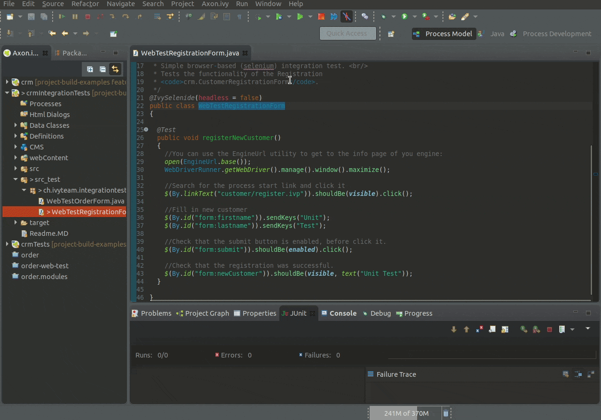

# project-build-examples compile-test

## run tests with designer
- Import `crm`, `crmTests` and `crmIntegrationTests` into designer
- Right-click in test class -> Run As -> JUnit Test

> Maybe disable headless flag on `IvyWebTest` annotation

## run tests with maven
- Open a command line and navigate into the unpacked `compile-test` folder.
- Run `mvn clean verify` to build the ivy project, run its web integration tests.

## dependencies

We use our [web-tester](https://github.com/ivy-supplements/web-tester) for all web tests.