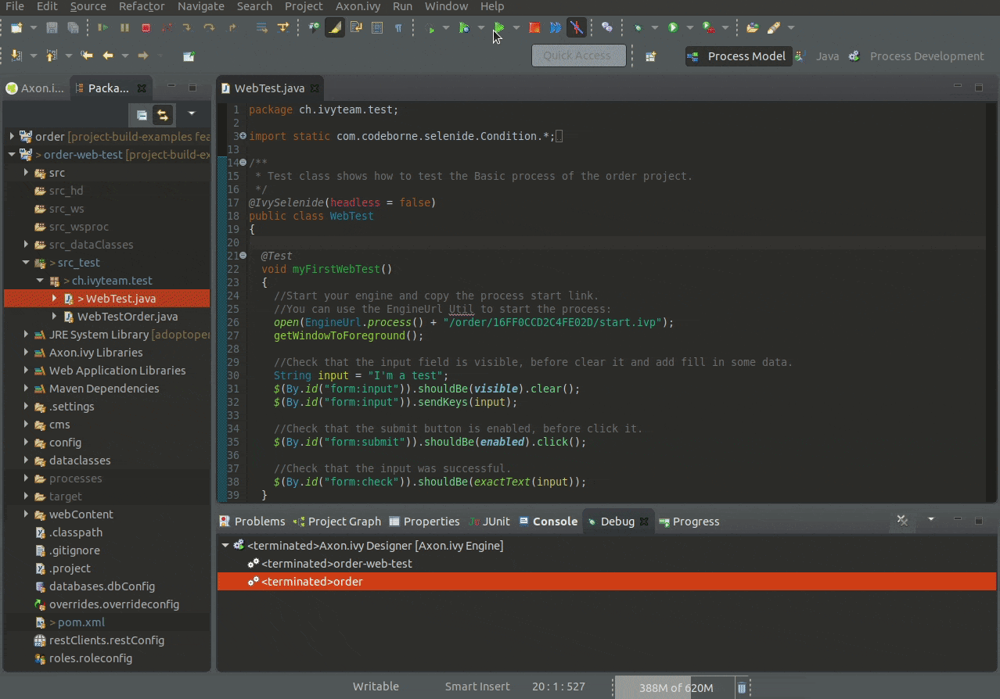

# project-build-examples web-test

## run web-tests with designer
- Import `order` and `order-web-test` into designer
- Right-click in test class -> Run As -> JUnit Test

> Maybe disable headless flag on `IvySelenide` annotation

## run web-tests with maven
- Open a command line and navigate into the unpacked `web-test` folder.
- Run `mvn clean verify` to build the ivy project, run its web integration tests.